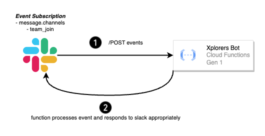

# XPLORERS SLACK BOT

An event driven serverless application which reacts to events happening in Slack. [Slack Event Subscriptions](https://api.slack.com/events-api) is a feature that allows developers to build apps that can receive and respond to events that occur within Slack. These events can be anything from a new message being posted in a channel to a user joining or leaving a workspace.

Once an app is subscribed to an event, Slack will send a payload containing information about the event to the app's specified endpoint (i.e., webhook). The app can then use this information to perform various actions, such as sending a notification, updating a database, or triggering a workflow.

## Prerequisites

Please follow the [prerequisites guide](docs/prerequisites.md) on instructions to setup required software and for authenticating to Google Cloud.

## Validating and applying configuration to Google Cloud

Terraform is an infrastructure as code tool that enables developers to automate the creation, modification, and deletion of infrastructure resources. Terraform is being used to deploy XplorersBot application to Google Cloud.

To run the following commands locally, ensure you have authenticated to Google Cloud, see [Login to Google Cloud via gcloud cli + setup application default credentials via Application Default Credentials (ADC)](#authenticate-to-google-cloud) for details.

1. Run `task terraform-init` to initialize terraform's backend and providers.
    1. Google provider is setup.
    2. Google cloud storage is used to store terraform's configuration. State locking is also supported.

2. Run `task terraform-plan` to generate a plan for the changes to be applied to Google Cloud.

3. Once you have reviewed the changes to be applied, run `task terraform-apply` to apply changes to Google Cloud.

To delete all the resources created by Terraform, run `task terraform-destroy`.

## Architecture Diagram

## Features

There are a million ways to drive engagement in Slack. Current features of XplorersBot are,

* ***Welcome a new slack user*** - When a user joins a slack channel, XplorersBot crafts a welcome message and posts in the channel to welcome the user.
* ***React to slack posts with emojis*** - With every slack post, XplorersBot checks the text for any keyword matches and reacts to the post with appropriate emoji's. For example, for text `This is a kubernetes environment`, XplorersBot will react to the post with `kubernetes` emoji.

> As every slack organisation can have custom emojis added, the emoji set `src/helpers/files/emojis.json` will need to be adjusted accordingly to fit your slack emoji set.

## Slack setup

Please follow [slack setup guide](docs/slack_setup.md) to configure event subscription and oauth permissions for the slack bot.

## Google Cloud resources

See [Google Cloud Resources](docs/google_cloud_resources.md) section for a list of resources deployed to Google Cloud to get the slack bot running.

## CI/CD with Github Actions and Google Cloud Workload Identity Federation

See [github actions](docs/cd_cd_with_github_actions.md) guide to understand how Continuous Integration (CI) and Continuous Delivery/Deployment (CD) works when using GitHub Actions and GCP Workload Identity Federation.

## Release tags

With the help of github actions and release drafter tool, a new release tag is created on every merge to `main`.
