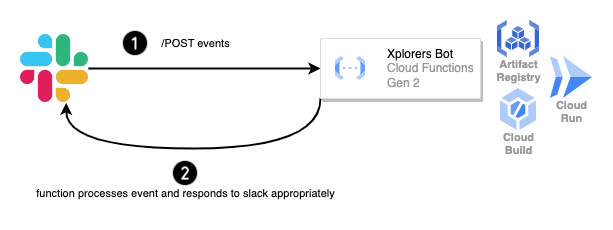

# XPLORERS SLACK BOT

An event driven serverless application which reacts to events happening in Slack. [Slack Event Subscriptions](https://api.slack.com/events-api) is a feature that allows developers to build apps that can receive and respond to events that occur within Slack. These events can be anything from a new message being posted in a channel to a user joining or leaving a workspace.

Once an app is subscribed to an event, Slack will send a payload containing information about the event to the app's specified endpoint (i.e., webhook). The app can then use this information to perform various actions, such as sending a notification, updating a database, or triggering a workflow.

### Required software
* [Google Cloud CLI](https://cloud.google.com/sdk/docs/install)
* [Terraform CLI](https://developer.hashicorp.com/terraform/cli)
* [Make](https://www.gnu.org/software/make/)

### Login to Google Cloud via gcloud cli + setup application default credentials via Application Default Credentials (ADC) {#authenticate-to-google-cloud}

Run [***gcloud init***](https://cloud.google.com/sdk/gcloud/reference/init) to authorize gcloud and other SDK tools to access Google Cloud using your user account credentials.

Run [***gcloud auth application-default login***](https://cloud.google.com/sdk/gcloud/reference/auth/login) to obtain access credentials for your user account via a web-based authorization flow. When this command completes successfully, it sets the active account in the current configuration to the account specified. If no configuration exists, it creates a configuration named default.

> ***Your gcloud credentials are not the same as the credentials you provide to ADC using the gcloud CLI.***

### Default configuration variables

The entrypoint for this repository is in the file `configuration/defaults.conf` which stores necessary environment variables used by the Makefile to orchestrate and apply the changes using Terraform. Change these values according to your project configuration,

* `GOOGLE_CLOUD_PROJECT_ID` - Google Cloud project ID to use
* `GOOGLE_CLOUD_PROJECT_REGION` - Google Cloud region to use
* `GOOGLE_CLOUD_PROJECT_ZONE` - Google Cloud zone to use
* `XPLORERS_ARTIFACTS_BUCKET_NAME` - Bucket to use to store artifacts and terraform state information
* `XPLORERS_ARTIFACTS_BUCKET_TERRAFORM_PREFIX` - Bucket prefix to store terraform state information

## Validating and applying configuration to Google Cloud

Terraform is an infrastructure as code tool that enables developers to automate the creation, modification, and deletion of infrastructure resources. Terraform is being used to deploy XplorersBot application to Google Cloud.

To run the following commands locally, ensure you have authenticated to Google Cloud, see [Login to Google Cloud via gcloud cli + setup application default credentials via Application Default Credentials (ADC)](#authenticate-to-google-cloud) for details.

1. Run `make init` to initialize terraform's backend and providers.
    1. Google provider is setup.
    2. Google cloud storage is used to store terraform's configuration. State locking is also supported.

2. Run `make plan` to generate a plan for the changes to be applied to Google Cloud.

3. Once you have reviewed the changes to be applied, run `make apply` to apply changes to Google Cloud.

To delete all the resources created by Terraform, run `make destroy`.

## Architecture Diagram

### Xplorers Bot

## Features

There are a million ways to use a bot make Slack fun. Current features of XplorersBot are,

* ***Welcome a new slack user*** - When a user joins a slack channel, XplorersBot crafts a welcome message and posts in the channel to welcome the user.
* ***React to slack posts with emojis*** - With every slack post, XplorersBot checks the text for any keyword matches and reacts to the post with appropriate emoji's. For example, for text `This is a kubernetes environment`, XplorersBot will react to the post with `kubernetes` emoji.

> As every slack organisation can have custom emojis added, the emoji set `src/helpers/files/emojis.json` will need to be adjusted accordingly to fit your slack emoji set.

## Slack setup

A Slack app event subscription with a bot user is required for Slack to send events to the API gateway endpoint.

After deploying the application to Google Cloud, refer to the documentation on [Slack Event Subscriptions](https://api.slack.com/events-api) to configure a [slack app](https://api.slack.com/authentication/basics) with an event subscription.

Use `xplorers_bot_function_uri` from terraform output as the event subscription url.

The following scopes are required for bot user to interact with Slack,
* chat:write - Send messages as bot user
* reactions:read - View emoji reactions and their associated content in channels and conversations that bot user has been added to
* reactions:write - Add and edit emoji reactions

Bot events to subscribe to,
* message.channels - A message was posted to a channel
* team_join - A new member has joined

Store the bot oauth token in Google Cloud Secrets. Set environment variable `SLACK_OAUTH_TOKEN` and run the make command `make create-slack-token-secret` to create a secret with the value of the slack token. The token is then mounted to Google Cloud functions which is available to the application code at runtime.

## Google Cloud resources

The following resources are created in google cloud for the application,

* [Cloud Functions Gen 2](https://cloud.google.com/functions/docs/concepts/version-comparison#new-in-2nd-gen)
    * [Cloud Build](https://cloud.google.com/build) build is created to generate and update docker images with application code we upload.
    * These artifacts are then stored in [Artifact Registry](https://cloud.google.com/artifact-registry) after the build is run.
    * Cloud Functions Gen 2 run on [Cloud Run](https://cloud.google.com/run) so a cloud run service is created for the application.
* [Service Account](https://cloud.google.com/iam/docs/service-account-overview) for cloud functions (cloud run under the hood)
* Permissions to interact with Google APIs to,
    * Fetch secrets
    * Write logs
    * Fetch artifact from storage bucket
    * Allow unauthenticated invocations; for Slack to send invoke cloud function with events (permission assigned to cloud run service)

## CI/CD with Github Actions and Google Cloud Workload Identity Federation

<!-- TODO -->
<!-- Xplorersbot uses Github Actions for its CI/CD pipeline. With every push from every branch, unit tests will run and the workflow is defined in `.github/workflows/run-tests.yml`. -->

Historically, applications running outside the Google Cloud had to rely on service account keys to access resources within the Google Cloud. However, as service account keys are long-lived credentials with permissions to interact and change the state of resources in the cloud, they pose a security threat if not managed appropriately.

Fortunately, through [workload identity federation](https://cloud.google.com/iam/docs/workload-identity-federation), external identities can be granted IAM roles, including the capability to impersonate service accounts and obtain a short-lived token. This approach effectively eliminates the security and maintenance overhead associated with service account keys.

[Service account impersonation](https://cloud.google.com/iam/docs/workload-identity-federation#impersonation) is used toobtain a short-lived OAuth 2.0 access token which lets github actions impersonate the service account to interact with Google Cloud APIs and deploy the application. Check out this [repository](https://github.com/xplorer-io/xplorers-gcloud-infra-bootstrap) for its implementation. Also see this [blog post](https://cloud.google.com/blog/products/identity-security/enabling-keyless-authentication-from-github-actions) to understand the github actions workflow with Google Cloud.

Together, [Github Actions](https://github.com/features/actions) and Terraform are being used to deploy XplorersBot to Google Cloud once the changes have been tested and peer reviewed and merged to the mainline branch.

With every pull request merge to `main` branch, actions will automatically update the production environment by deploying to Google Cloud (workflow `.github/workflows/deploy-xplorers-bot.yml`)

## Release tags

With the help of github actions and release drafter tool, a new release tag is created on every merge to `main`.
