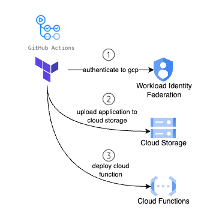

## CI/CD with Github Actions and Google Cloud Workload Identity Federation

Xplorersbot uses Github Actions for its CI/CD pipeline. With every push from every branch, unit tests will run and the workflow is defined in `.github/workflows/run-ci-tests.yml`.

Historically, applications running outside the Google Cloud had to rely on service account keys to access resources within the Google Cloud. However, as service account keys are long-lived credentials with permissions to interact and change the state of resources in the cloud, they pose a security threat if not managed appropriately.

Fortunately, through [workload identity federation](https://cloud.google.com/iam/docs/workload-identity-federation), external identities can be granted IAM roles, including the capability to impersonate service accounts and obtain a short-lived token. This approach effectively eliminates the security and maintenance overhead associated with service account keys.

[Service account impersonation](https://cloud.google.com/iam/docs/workload-identity-federation#impersonation) is used toobtain a short-lived OAuth 2.0 access token which lets github actions impersonate the service account to interact with Google Cloud APIs and deploy the application. Check out this [repository](https://github.com/xplorer-io/xplorers-gcloud-infra-bootstrap) for its implementation. Also see this [blog post](https://cloud.google.com/blog/products/identity-security/enabling-keyless-authentication-from-github-actions) to understand the github actions workflow with Google Cloud.

Together, [Github Actions](https://github.com/features/actions) and Terraform are being leveraged to deploy XplorersBot to Google Cloud once the changes have been tested and peer reviewed and merged to the mainline branch.

With every pull request merge to `main` branch, actions will automatically update the production environment by deploying to Google Cloud (workflow `.github/workflows/deploy-xplorers-bot.yml`)

