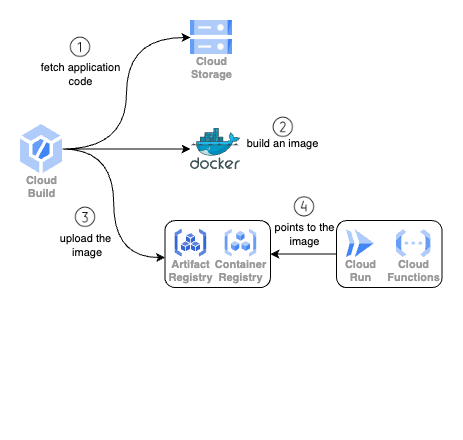

## Google Cloud resources

The following resources are created in google cloud for the application,

* [Cloud Functions Gen 1](https://cloud.google.com/functions/docs/concepts/version-comparison#new-in-2nd-gen)
    * [Cloud Build](https://cloud.google.com/build) build is created to generate and update docker images with application code we upload.
    * These artifacts are then stored in [Container Registry](https://cloud.google.com/container-registry) after the build is run.
    * Cloud Functions Gen 1 then uses the built image to run the application at runtime.
* [Service Account](https://cloud.google.com/iam/docs/service-account-overview) for cloud functions (cloud run under the hood)
* Permissions to interact with Google APIs to,
    * Fetch secrets
    * Write logs
    * Fetch application zip artifact from storage bucket
    * Allow unauthenticated invocations; for Slack to send invoke cloud function with events

### Cloud Functions Gen 2

* [Cloud Functions Gen 2](https://cloud.google.com/functions/docs/concepts/version-comparison#new-in-2nd-gen)
    * [Cloud Build](https://cloud.google.com/build) build is created to generate and update docker images with application code we upload.
    * These artifacts are then stored in [Artifact Registry](https://cloud.google.com/artifact-registry) after the build is run.
    * Cloud Functions Gen 2 run on [Cloud Run](https://cloud.google.com/run) so a cloud run service is created for the application.

### Cloud Functions Build Process

