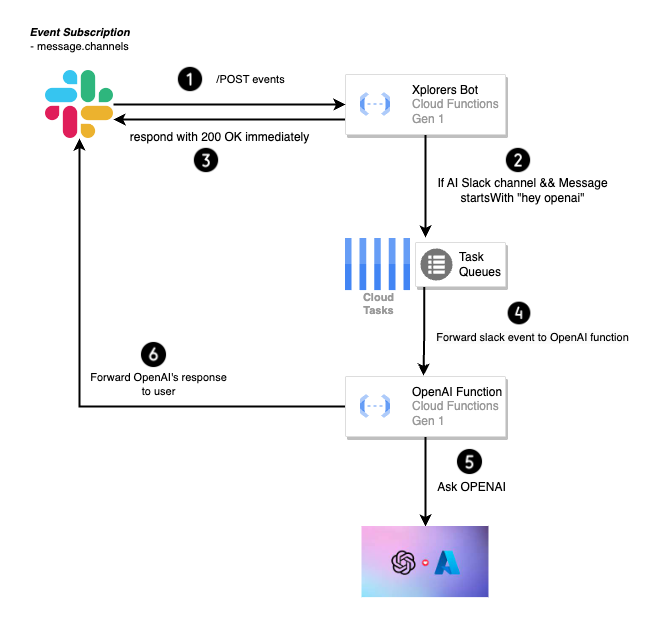

## Interacting with the Azure OpenAI API from Slack

[Azure OpenAI](https://learn.microsoft.com/en-us/azure/cognitive-services/openai/overview) is a cloud-based service that provides access to OpenAI's powerful language models, including GPT-3, Codex, and DALL-E. It is designed for enterprise customers who need to use these models in a secure and compliant environment.

### Architecture Diagram

### Prerequisites

For the corresponding terraform workspace (set via environment vairable TF_WORKSPACE), create the following secrets in GCP for the OpenAI function to fetch and interact with Azure OpenAI,

* azure-openai-endpoint-{TF_WORKSPACE}
* azure-openai-key-{TF_WORKSPACE}

where {TF_WORKSPACE} will be replaced by the current terraform workspace in use.

If you are testing the function locally, set these environment variables instead before running `task run-cloudfunctions-framework`,

* AZURE_OPENAI_ENDPOINT
* AZURE_OPENAI_KEY

Follow Azure's documentation [here](https://learn.microsoft.com/en-us/azure/cognitive-services/openai/how-to/create-resource) on how to create an OpenAI resource and deploy a model to it. See [this](https://learn.microsoft.com/en-us/azure/cognitive-services/openai/quickstart?tabs=command-line&pivots=programming-language-javascript#:~:text=Retrieve%20key%20and%20endpoint) example to understand keys and endpoints and where to retrieve them from.

Finally, replace the default environment variable `AZURE_OPENAI_DEPLOYMENT_ID` according to your deployment in Azure.

### Interacting with OpenAI from Slack

* To stop the application from responding to every single text message in the channel, the bot will only respond to messages that start with `hey openai`. For example, `hey openai, tell me a joke` will trigger the bot to respond with a joke.
* Users can only interact with OpenAI in the channel specified in the environment variable `XPLORERS_OPENAI_SLACK_CHANNEL_ID` which is the channel `C05G6U88QMC(#ask-openai)` in Xplorers Slack Workspace. This is to prevent the bot from responding to messages in every channel it is invited to.

### Deploy your feature branch to Google Cloud

Follow the steps in [feature branch deployment guide](docs/feature_branch_deployment.md) to deploy your feature branch to Google Cloud.
